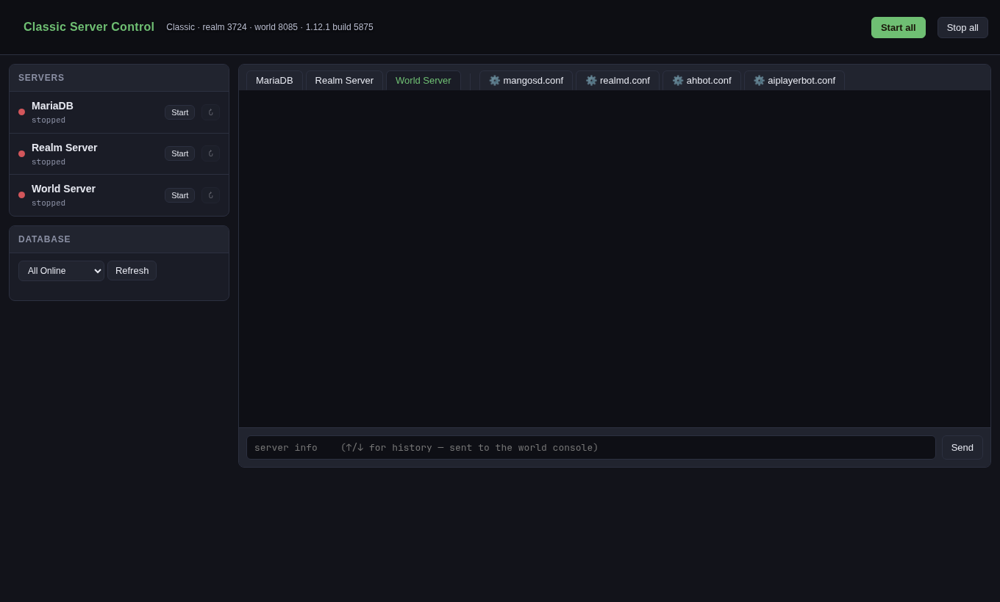

# wowadmin

A small web control panel for a **local World of Warcraft emulator realm**.
Start and stop your database, auth and world servers in the right order, watch
each one's console, type into the world console, see who is online, and edit
your `.conf` files — in one browser tab.

It is core-agnostic. Every path, port, query, readiness signal and piece of
branding lives in one TOML file, so the same code drives CMaNGOS, AzerothCore,
TrinityCore or a fork of any of them without touching the source.



## Who this is for

People who run **one or two realms on their own machine** for themselves or a
handful of friends, and are tired of juggling three terminals in a fixed order.
If you run a public realm with other admins, you want something with accounts,
audit logs and a real process supervisor — this is not that (see
[Security](#security)).

Tested against two live installs: **CMaNGOS Classic 1.12.1** (bundled MariaDB,
`realmd` + `mangosd`, playerbots) and an **AzerothCore 3.3.5a fork** (bundled
MySQL 8.4, `authserver` + `worldserver`). Profiles for other cores ship as
untested starting points and are clearly labelled as such.

## What it does

- **Ordered start and stop.** Servers start in the order they appear in the
  config, each one waited for, and stop in reverse. If one fails to come up,
  the rest are not started and every console says why.
- **Readiness that means something.** A server is "running" when its port
  opens or its own log says it is ready — not after a guessed delay.
- **A console per server**, streamed live, with command history.
- **Servers outlive the panel.** Each one writes to its own log file, which
  the panel tails, and takes console input through a FIFO. Neither stream
  belongs to the panel process, so closing it — or killing it, or a crash —
  leaves your realm running, and the next panel picks the consoles back up.
- **Graceful shutdown first**: the world server is asked to shut down through
  its own console, then SIGTERM, then SIGKILL, with your timeout between.
- **Retries during startup** for the server that always loses the race with
  the database.
- **Who's online**, from your own SQL. Any number of named filters become a
  dropdown; the header shows a live count.
- **A config editor** for the files you list, with syntax highlighting,
  find, an "edited elsewhere" guard, a timestamped backup and an atomic write.
- **Adoption** of servers the panel did not start — from an earlier panel, or
  from your own terminal. They show up with their uptime, their console still
  streams, and they can be shut down through it rather than by signal
  (optional, needs `psutil`).
- **Your branding**: title, logo, header banner, favicon and the whole colour
  palette, so two realms never get mistaken for each other.

## What it does not do

- No account management, no GM tools, no web client — use your core's own
  console commands and your database.
- No installing, building or updating a core. It runs what you already have.
- No systemd units, no init integration, no running at boot. You open the
  panel when you want to play.
- No clustering, no multi-machine control. One box, one panel per realm.

## Requirements

- Linux (or anything with POSIX process groups and signals)
- Python **3.11+** — nothing else. The panel is stdlib-only.
- Optionally `psutil`, and only for one feature: detecting servers that were
  started outside the panel. Without it, those show as stopped. Install it
  from your distro (`python-psutil`, `python3-psutil`) or with
  `pip install -r requirements.txt`.
- A `mysql` or `mariadb` **command-line client** if you want the roster panel.
  The one bundled with your server is fine, and usually the right choice.

## Quick start

```bash
git clone https://github.com/nzkritik/wowadmin
cd wowadmin

# Start from the profile closest to your core, or from the fully commented
# wowadmin.example.toml if none of them fits.
cp examples/cmangos-classic.toml wowadmin.toml

# Edit the [vars] block at the top: for most installs that is the only
# section you must change.
$EDITOR wowadmin.toml

./run.sh
```

The panel opens itself in your browser at `http://127.0.0.1:8090`. Closing it
leaves the game servers running — it supervises them, it does not own them.
Open it again later and it finds them where it left them.

`./run.sh --no-browser` skips opening a tab. `./run.sh --print-config` shows
the config with every variable resolved, which is the fastest way to find a
path typo.

### A desktop launcher

```bash
sed -e "s|@INSTALL@|$PWD|g" -e "s|@CONFIG@|$PWD/wowadmin.toml|g" \
    wowadmin.desktop.in > ~/.local/share/applications/wowadmin.desktop
update-desktop-database ~/.local/share/applications
```

## Adapting it to your core

Four things differ between cores. Everything else is shared.

**1. Paths.** Set `[vars].root` to your server install — the directory with
`bin/` and `etc/` in it. Every other path in the file is written as
`${root}/…`, so one line usually does it.

**2. Database names in the queries.** wowadmin never invents table names; the
SQL under `[database]` is yours. Run `SHOW DATABASES;` against your server and
make the queries match. The shipped profiles use each core's defaults:

| Core | Auth DB | Characters DB | GM level lives in |
|---|---|---|---|
| CMaNGOS Classic | `classicrealmd` | `classiccharacters` | `account.gmlevel` |
| AzerothCore | `acore_auth` | `acore_characters` | `account_access.gmlevel` |
| TrinityCore | `auth` | `characters` | `account_access.gmlevel` |

**3. The ready line.** `ready_pattern` is a regular expression matched against
the server's own output. Capitalisation differs — AzerothCore writes `World
Initialized`, CMaNGOS and TrinityCore write `World initialized`. Start your
world server by hand once, see what it prints when it finishes loading, and
use that. Where a port is enough, `ready_port` is cheaper and more reliable.

Point `executable` at the binary that actually runs, not at a wrapper script
that launches it in the background: the panel identifies a running server by
its executable, so a wrapper can be started but never recognised or stopped.

**4. Your bot account convention**, if you run bots. `[vars].bot_pattern` is
substituted into the queries, so the Players / Bots split works whatever your
bots are called.

If your core has no bots, leave `bot_pattern` unset and the bot-only views
disappear by themselves — see [Realms without bots](#realms-without-bots).

## Configuration

`wowadmin.example.toml` documents every key inline. The short version:

| Section | What it controls |
|---|---|
| `[vars]` | Your own `${name}` substitutions — paths, patterns, anything |
| `[app]` | Bind address, port, poll rates, shutdown timeouts, browser |
| `[branding]` | Title, logo, banner, icons, console hint, colour theme |
| `[realm]` | The line shown in the header |
| `[database]` | Client, credentials, the online count, the roster filters |
| `[servers.*]` | One section per managed process, in start order |
| `[configs]` | Which files the editor may open |

### Variables

Any `${name}` in the file is replaced from `[vars]`, then from the
environment. It applies everywhere — paths, arguments, stop commands and SQL
alike. Two are always defined: `${config_dir}` (the directory this file is in)
and `${home}`. An unknown name is left as a literal `${…}` and warned about at
startup, rather than silently becoming an empty string.

### Servers

Each `[servers.<name>]` section is one process. They start top to bottom and
stop bottom to top.

| Key | Meaning |
|---|---|
| `executable` | Path, or a bare command looked up on `PATH` |
| `match_executable` | The real binary, when `executable` is a wrapper script |
| `log_file`, `log_append` | Where its output goes; appended rather than replaced |
| `args`, `working_dir`, `env` | How to launch it |
| `enabled` | `false` leaves it out of the panel entirely |
| `manage` | `false` = watch only; never start or stop it |
| `ready_port` / `ready_pattern` | How "starting" becomes "running" |
| `ready_timeout` | Seconds to wait for that before giving up watching |
| `retry_delay`, `max_retries` | Retry a server that dies *during* startup |
| `console` | It reads commands on stdin — gives it a command bar |
| `stop_console_command` | The graceful stop, `{delay}` is your warning time |
| `stop_command` | An external stop (e.g. `mysqladmin shutdown`) |

With none of the stop options, a server gets SIGTERM and then, after
`shutdown_timeout`, SIGKILL.

### A database you do not manage

Running your distro's MySQL or MariaDB as a system service? Either leave it
out of `[servers]` entirely and set `[database].port` so the panel can still
tell whether it is up, or declare it with `manage = false` to see its status
in the list without the panel ever starting or stopping it.

### Branding

Point `[branding]` at your own image files — absolute paths, or relative to
your config. They are served by name, so your artwork can live next to your
server install and never enters this repository.

**No artwork ships with wowadmin, and you should not commit any into a fork.**
WoW logos, splash art and UI textures are Blizzard's. Use them locally all you
like; do not redistribute them.

### Realms without bots

Plenty of cores have no playerbots, and an "Online Bots" tab that is forever
empty is just noise. So a filter can declare that it needs them:

```toml
[database.filters]
"All Online"  = '''SELECT …'''
"Online Bots" = { needs_bots = true, sql = '''SELECT …''' }
```

A filter written as plain SQL is always offered; one written as a table with
`needs_bots = true` is hidden unless the realm has bots. Whether it does is
taken from `[database].bots`, or inferred from whether `[vars].bot_pattern` is
set — so on a realm that never mentions bots, the shipped profiles drop their
bot tab with no editing at all.

Only mark the views that are *about* bots. A filter that merely excludes them,
like an account list, needs no marking: `${bot_pattern}` is always defined, and
on a bot-free realm it is empty, so `NOT LIKE ''` excludes nothing and the
filter goes on showing everybody. That is the distinction the marking exists
to make, and it cannot be guessed from the SQL.

### Logs and consoles

Each managed server's output goes to `$XDG_STATE_HOME/wowadmin/<config name>/`
(usually `~/.local/state/wowadmin/…`) as `<server>.log`, alongside a
`<server>.stdin` FIFO for the ones that take console input. That directory is
per config file, so two realms never share either. Override it with
`[app].log_dir`, or a single server's with `log_file`.

A log is replaced at each start. Set `log_append = true` on a server to keep
the history instead — nothing rotates it for you. These are the panel's view
of the console, not a substitute for the logs your core writes itself.

### More than one realm

Give each realm its own TOML with its own `[app].port`, and run one panel per
realm from the same checkout:

```bash
./run.sh --config ~/realms/classic.toml     # :8090
./run.sh --config ~/realms/wotlk.toml       # :8091
```

Set a different `[branding.theme].accent` for each and you will never type a
command into the wrong one.

## Security

**The panel has no authentication.** Anyone who can reach it can start and
stop your servers, edit the config files you listed, and type anything into
your world console. It therefore binds `127.0.0.1` and refuses any other
address unless you explicitly set `allow_remote_without_auth = true`.

To use it from another machine, tunnel rather than expose it:

```bash
ssh -N -L 8090:127.0.0.1:8090 you@your-server
```

Two things the panel does do carefully: the browser never sends a filesystem
path (it sends a *name*, which the server looks up in your config, so there is
nothing to traverse), and a database password is passed to the client through
`MYSQL_PWD` rather than on the command line where any user on the box could
read it out of `/proc`. Better still, use a `--defaults-file` that only you
can read and keep the password out of the config altogether.

## Troubleshooting

**"cannot listen on 127.0.0.1:8090"** — another panel is already there. Change
`[app].port` or stop the other one.

**A server sits on "starting" forever** — its `ready_pattern` never matched or
its `ready_port` never opened. Watch its console tab: the server itself is
usually saying why. The process keeps running either way; only the badge is
wrong.

**"not executable: …"** — run `./run.sh --print-config` and check the resolved
path. A `${var}` left literal in the output is an undefined variable.

**The roster is empty but the server is up** — your SQL does not match your
schema. The exact client error is shown in the panel where the table would be.

**A server shows "stopped" although it is running** — you started it outside
the panel and `psutil` is not installed. That is the one feature that needs it.

## Developing

`python3 tests/smoke.py` starts a panel against a stand-in server in a
temporary directory and exercises every endpoint — start, readiness, console,
config editor, graceful stop — once with bots configured and once without. It
needs no realm and no database. Run it before sending a change; a panel that
prints its banner can still fail on the first request.

## Contributing

Profiles for cores not covered here are very welcome, especially tested ones:
say in the header which core, which version and which install layout you ran
it against. Corrections to the untested profiles are just as useful.

## Licence

MIT — see [LICENSE](LICENSE).

Not affiliated with or endorsed by Blizzard Entertainment, nor by any
emulator project. World of Warcraft is a trademark of Blizzard Entertainment.
